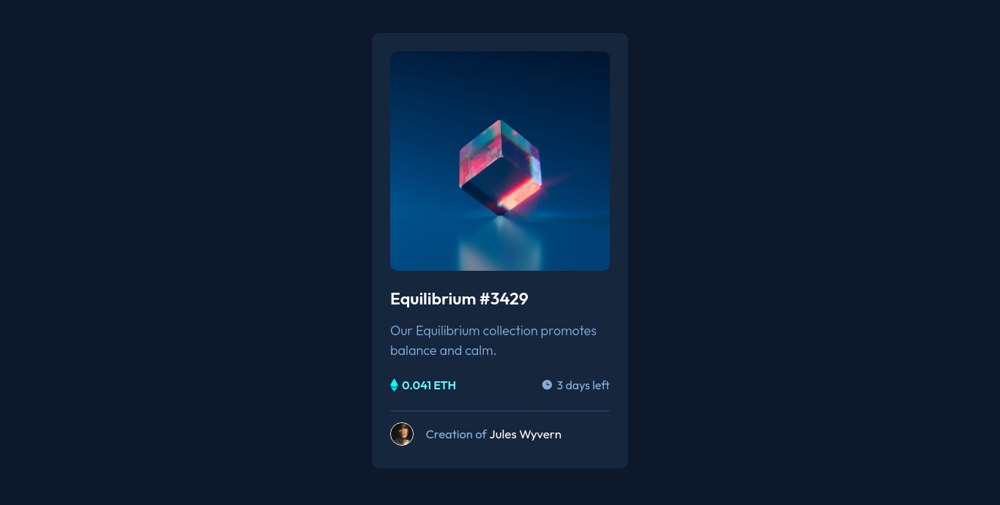
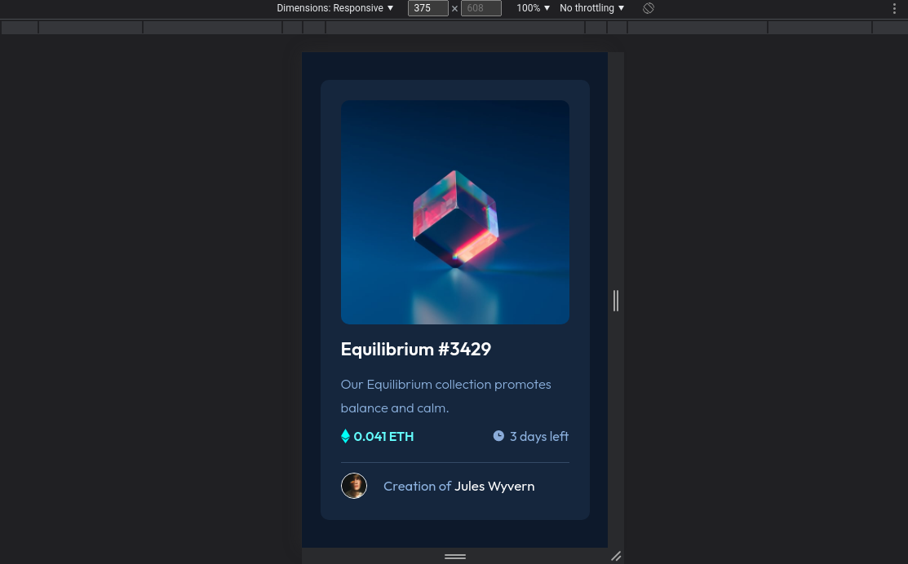

# Frontend Mentor - Product preview card component solution

This is a solution to the [Product preview card component challenge on Frontend Mentor](https://www.frontendmentor.io/challenges/product-preview-card-component-GO7UmttRfa).

## Table of contents

- [Overview](#overview)
  - [Screenshot](#screenshot)
  - [Links](#links)
- [My process](#my-process)
  - [Built with](#built-with)
  - [What I learned](#what-i-learned)
  - [Useful resources](#useful-resources)
- [Author](#author)
- [Acknowledgments](#acknowledgments)

## Overview

### Screenshot

#### Desktop



#### Mobile



### Links

- Solution URL: [Github](https://github.com/kent5205/NFT-Preview-Card-Component)
- Live Site URL: [Vercel](https://nft-preview-card-component-delta-eight.vercel.app/)

## My process

### Built with

- Semantic HTML5 markup
- CSS custom properties
- Flexbox
- Mobile-first workflow
- Media Queries

### What I learned

This challenge helps me understand more about flexbox, media queries, hover state and a little bit of grid. Though this is not not perfectly pixelated because I have a smaller screen. Still a fun challenge.

Also I learn about Pseudo-Elements( that looks like this

```css
selector::pseudo-element
```

) it was pretty handy to me in this challenge.

#### Pseudo-Element that I recently learned

```css
.view-bg::before {
  content: "";
  background-color: var(--styling-color);
  height: 100%;
  width: 100%;
  border-radius: 0.625rem;
}
```

#### My full CSS Code

```css
/*--- Reset default values ---*/
*,
*::before,
*::after {
  box-sizing: border-box;
}

body,
h1,
h2,
h3,
h4,
p,
li,
figure,
figcaption,
blockquote,
dl,
dd {
  margin: 0;
}

html:focus-within {
  scroll-behavior: smooth;
}

img {
  max-width: 100%;
  display: inline-block;
}

/*--- Variable Used ---*/
:root {
  --body-bg-color: hsl(216, 55%, 11%);
  --main-bg-color: hsl(214, 49%, 16%);
  --primary-font-color: hsl(0, 0%, 100%);
  --secondary-font-color: hsl(213, 55%, 71%);
  --styling-color: hsl(180, 96%, 69%);
}

/*--- Global Styling ---*/
body {
  min-height: 100vh;
  font-family: "Outfit", sans-serif;
  font-size: 1.125rem;
  background-color: var(--body-bg-color);
  display: flex;
  align-items: center;
  justify-content: center;
}

main {
  width: 20.625rem;
  height: 33.75rem;
  background-color: var(--main-bg-color);
  padding: 1.5625rem;
  border-radius: 0.625rem;
}

h1 {
  font-size: 1.4063rem;
  font-weight: 600;
  margin: 0.9375rem 0rem 0.9375rem 0rem;
  color: var(--primary-font-color);
}

a {
  text-decoration: none;
  color: var(--primary-font-color);
  transition: 250ms ease;
}

p {
  font-size: 1.0313rem;
  line-height: 1.75;
  font-weight: 300;
  color: var(--secondary-font-color);
}

/*--- Class Styling ---*/

.hero-container {
  position: relative;
  height: 17.1875rem;
}

.hero-container > img {
  height: 100%;
  width: 100%;
}

.hero-container,
.hero-container img {
  border-radius: 0.625rem;
}

.view-bg::before,
.view-bg img {
  opacity: 0;
  position: absolute;
  transition: all 250ms ease;
  top: 50%;
  left: 50%;
  transform: translate(-50%, -50%);
}

.view-bg::before {
  content: "";
  background-color: var(--styling-color);
  height: 100%;
  width: 100%;
  border-radius: 0.625rem;
}

.eth-info {
  display: flex;
  justify-content: space-between;
  align-items: center;
  margin-top: 0.625rem;
}

.eth-info span {
  font-size: 1rem;
}

.eth-balance span {
  font-weight: 600;
  color: var(--styling-color);
  text-transform: uppercase;
}

.eth-time-left span {
  color: var(--secondary-font-color);
  font-weight: 400;
}

.eth-balance,
.eth-time-left {
  display: flex;
  align-items: center;
  justify-content: center;
}

.eth-balance span,
.eth-time-left span {
  margin-left: 0.3125rem;
}

.creator-container img {
  height: 2rem;
  width: 2rem;
  border-radius: 50%;
  border: 0.0625rem solid var(--primary-font-color);
}

.creator-container {
  display: flex;
  align-items: center;
  justify-content: space-between;
  width: 85%;
}

.creator {
  color: var(--secondary-font-color);
  font-size: 1.0313rem;
}

.creator > a {
  color: var(--primary-font-color);
  font-size: 1.0625rem;
}

.line {
  width: 100%;
  background-color: var(--secondary-font-color);
  opacity: 25%;
  height: 0.0625rem;
  margin: 1.375rem 0rem 0.75rem 0rem;
}

/*--- Adding hover state for devices that support it---*/
@media (hover: hover) {
  a:hover {
    color: var(--styling-color);
  }

  .view-bg:hover:before {
    opacity: 0.5;
    cursor: pointer;
  }

  .view-bg:hover img {
    cursor: pointer;
    opacity: 1;
  }
}

@media screen and (min-width: 45rem) {
  main {
    height: 37.1875rem;
    width: 21.875rem;
  }

  h1 {
    font-size: 1.4375rem;
    margin: 1.4063rem 0rem 1rem 0rem;
  }

  p {
    font-size: 1.125rem;
    line-height: 1.5;
  }

  .hero-container {
    height: 18.75rem;
  }

  .eth-info {
    margin: 1.5rem 0rem 1.5625rem 0rem;
  }

  .creator-container {
    margin-top: 0.9375rem;
    width: 78%;
  }
}
```

### Useful resources

- [W3School](https://www.w3schools.com/w3css/defaulT.asp) - This is my reference when I tend to forget some CSS properties.

- [A Modern CSS Reset](https://piccalil.li/blog/a-modern-css-reset/) - This helps me in resetting default CSS properties.

- [CSS Tricks](https://css-tricks.com/solving-sticky-hover-states-with-media-hover-hover/) - This article assists me in using media query for hover state.

## Author

- Frontend Mentor - [@kent5205](https://www.frontendmentor.io/profile/kent5205)

## Acknowledgments

I personally wanted to thank [バレンタイン 😈](https://www.frontendmentor.io/profile/vcarames) for his suggestions in my previews challenge solution and [Frontend Mentor](https://www.frontendmentor.io/) for this wonderful opportunity for me to learn in an enjoyable way. 🖤
